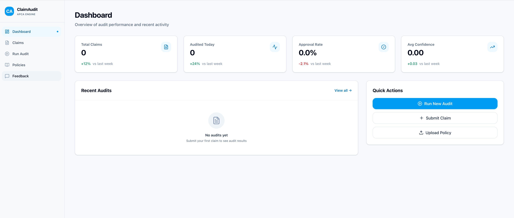
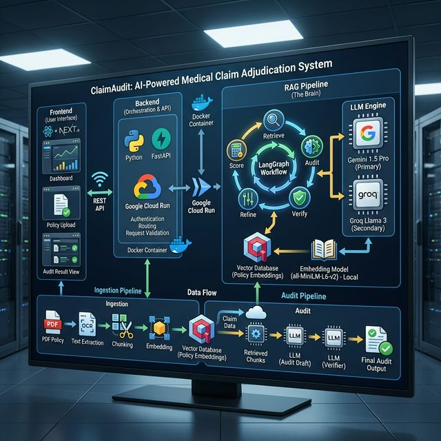

# ClaimAudit: AI-Powered Medical Claim Adjudication



## System Architecture



This diagram illustrates the comprehensive flow of data through the ClaimAudit system:
1.  **Frontend**: User submits claims or uploads policies.
2.  **API Gateway**: FastAPI router handles requests and validation.
3.  **Ingestion Service**: Processes PDF policies into vector embeddings.
4.  **Audit Pipeline**: The LangGraph engine orchestrates the multi-step reasoning (Retrieve > Audit > Verify > Refine).
5.  **LLM Layer**: Dynamically selects between Gemini and Groq for inference.

ClaimAudit is a next-generation medical claim adjudication platform powered by **Agentic AI**. It uses advanced Retrieval-Augmented Generation (RAG) to autonomously audit medical claims against complex payer policies, providing definitive "Approve" or "Deny" recommendations with citations.

Traditional claim auditing is manual, error-prone, and slow. ClaimAudit automates this by enforcing policy rules with strict verification steps, significantly reducing administrative overhead and enhancing accuracy.

## Key Features

### 🚀 Scalability & Architecture
The entire system is containerized and deployed on **Google Cloud Run**, ensuring serverless scalability.
- **Backend**: FastAPI (Python) handles the orchestration and API logic.
- **Frontend**: Next.js (TypeScript) provides a responsive, modern dashboard.
- **Vector Search**: Qdrant (for policy ingestion and retrieval) ensures fast, semantic search across thousands of policy documents.
- **Dockerized**: A single `Dockerfile` builds the entire stack for consistent deployment across environments.

### 🛡️ Hallucination Reduction
One of the biggest challenges in AI is "hallucination" — where the model invents facts. ClaimAudit mitigates this through a multi-step verification pipeline:
1.  **Strict Context**: The LLM is forced to use *only* the retrieved policy chunks.
2.  **Verifier Agent**: A dedicated "Audit Integrity Officer" agent reviews the draft audit. If it finds any claim not supported by the text, it rejects the draft.
3.  **Citation Requirement**: Every rule application *must* quote the policy text directly.

### 🤖 Multi-Agent LangGraph
The core adjudication logic is built on **LangGraph**, creating a stateful, cyclic workflow:
- **Retrieve Node**: Fetches relevant policy sections based on CPT/ICD codes.
- **Audit Node**: An "Auditor" agent drafts the initial decision.
- **Verify Node**: A "Verifier" agent checks for hallucinations and logic errors.
- **Refine Node**: If errors are found, the "Refiner" agent corrects the draft.
- **Score Node**: Calculates a confidence score based on the strength of evidence.

This cyclic graph ensures that the final output is not just a one-shot guess, but a rigorously reviewed decision.

### 🔍 Citation Mechanism
Transparency is critical. ClaimAudit provides "clickable" citations:
- **Exact Quotes**: The system extracts the specific sentence from the PDF that justifies the decision.
- **Source Linking**: Each citation links back to the exact page and section of the policy document.
- **Visual Proof**: Users can see the highlighted text in the policy viewer alongside the audit result.

## Tech Stack
-   **AI/LLM**: Google Gemini 1.5 Pro (Primary) / Groq Llama 3 (Secondary)
-   **Orchestration**: LangGraph, LangChain
-   **Backend**: FastAPI, Uvicorn
-   **Frontend**: Next.js, Tailwind CSS, Lucide React
-   **Database**: Qdrant (Vector), Supabase (Relational - *Roadmap*)
-   **Infrastructure**: Google Cloud Run, Docker

## Getting Started

### Prerequisites
-   Docker
-   Google Cloud Project (for deployment)
-   API Keys (Google Gemini, Groq - optional)

### Running Locally
```bash
# 1. Clone the repository
git clone https://github.com/bishalbashyal33/claimsaudit.git
cd claimsaudit

# 2. Build and run with Docker
docker-compose up --build
# OR manually
npm run dev --prefix frontend
uvicorn backend.main:app --reload
```

### Deployment to Cloud Run 
```bash
gcloud run deploy claimsaudit --source .
```

---

